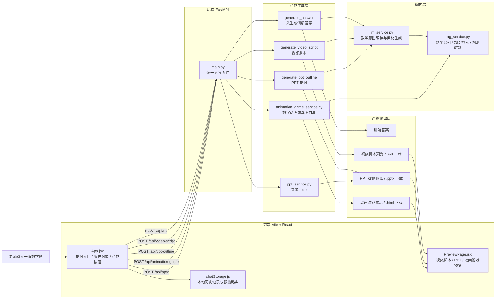
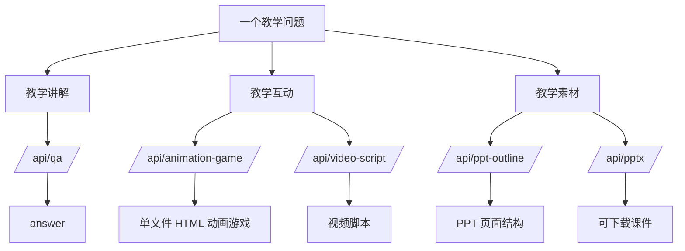
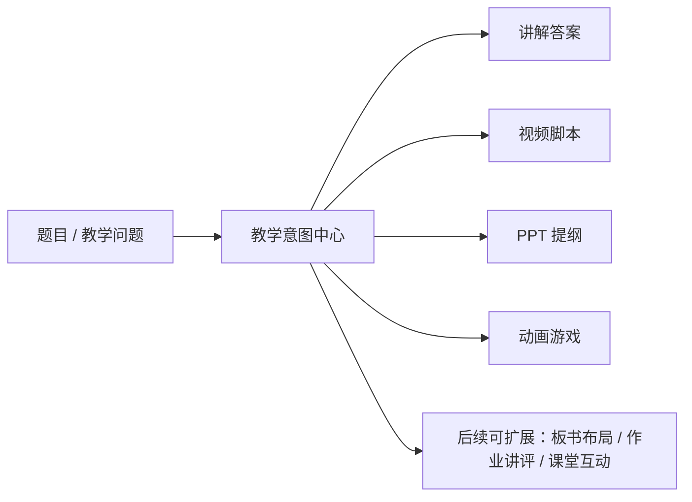

# 飞象老师式工作流技术架构图

这份图不是在复刻飞象老师的具体实现细节，而是把它那种“同一个教学意图，分发成讲解、动画、游戏、课件”的工作流，拆到当前仓库的可执行技术架构里。

## 总体架构



## 飞象老师式拆法在当前项目里的对应关系



## 当前仓库里的职责分层

### 1. 交互壳层

- `frontend/src/App.jsx`
  - 类似飞象老师的“聊天工作台”
  - 负责提问、历史记录、素材按钮、状态切换
- `frontend/src/lib/chatStorage.js`
  - 负责把一次提问抽象成统一会话对象
  - 会话下挂 `answer / video / ppt / animationGame`
- `frontend/src/components/PreviewPage.jsx`
  - 负责把不同产物切到统一预览页
  - 视频脚本、PPT、动画游戏共用这一层

### 2. API 入口层

- `backend/app/main.py`
  - 统一暴露产物接口
  - 这层的作用相当于飞象老师工作台里的“路由分发器”
  - 当前已经具备：
    - `POST /api/qa`
    - `POST /api/video-script`
    - `POST /api/ppt-outline`
    - `POST /api/animation-game`
    - `POST /api/pptx`

### 3. 教学意图编排层

- `backend/app/llm_service.py`
  - 相当于“教学意图 -> 产物类型”的编排层
  - 负责把同一道题转换成：
    - 讲解答案
    - 视频脚本
    - PPT 提纲
  - 这里最接近飞象老师的 `AI_TEACHING_INTERACTION` 主工作流

### 4. 题型与知识底座

- `backend/app/rag_service.py`
  - 负责题型判断、知识检索、规则求解、fallback 讲解
  - 这是“让同一道题能被拆成不同产物”的底层前提
  - 本质上承担了飞象老师那种“教学内容结构化”的一部分职责

### 5. 产物模板层

- `backend/app/animation_game_service.py`
  - 当前相当于“动画子功能”
  - 做的事情是：
    - 判断题型
    - 自动搜图
    - 拼接成单文件 HTML
    - 产出可试玩的数字动画游戏
- `backend/app/ppt_service.py`
  - 当前相当于“课件导出子功能”
  - 把结构化 PPT 提纲导出为 `.pptx`

## 这套架构和飞象老师最像的地方

不是“先决定做动画”，而是：

1. 先抽象教学问题
2. 再判断属于哪一类教学互动
3. 最后把同一个问题分发成不同产物

也就是说，这个项目现在的正确演进方向不是“一个个功能散着长”，而是下面这条主线：



## 如果继续向飞象老师式架构演进，下一步建议

### 方案 A：加“教学意图中心”

把当前分散在 `llm_service.py`、`animation_game_service.py` 的题型判断和素材路由，抽到一个统一的 `teaching_workflow_service.py`。

职责：

- 输入：`grade + question + mode`
- 输出：统一 `TeachingSessionSpec`
- 里面包含：
  - `intent`
  - `knowledge_docs`
  - `solved_steps`
  - `recommended_outputs`
  - `theme`
  - `assets`

### 方案 B：把动画游戏做成模板引擎

当前动画 HTML 还是单模板。

下一步可以拆成：

- `equal_share_game_template`
- `addition_merge_game_template`
- `subtraction_left_game_template`
- `multiplication_group_game_template`
- `geometry_demo_template`

这样才更接近“飞象老师式教学动画”的稳定产出能力。

### 方案 C：统一产物数据模型

给前后端都定义一层统一结构：

```ts
type TeachingArtifact =
  | { kind: 'answer'; payload: ... }
  | { kind: 'video_script'; payload: ... }
  | { kind: 'ppt_outline'; payload: ... }
  | { kind: 'animation_game'; payload: ... }
```

这样前端的历史记录、预览页、下载按钮、未来的分享链接都可以走同一套协议。

## 对当前项目最重要的一句话

飞象老师式工作流的核心，不是“动画炫”，而是：

同一个教学问题，先被理解，再被结构化，最后被分发成多个教学产物。

当前仓库已经有这个雏形，只差把“统一编排层”和“多模板动画层”继续做厚。
